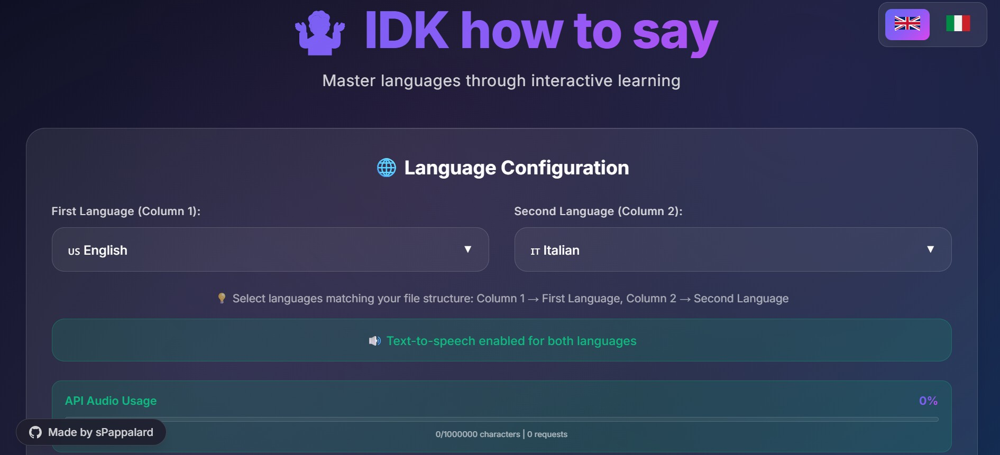
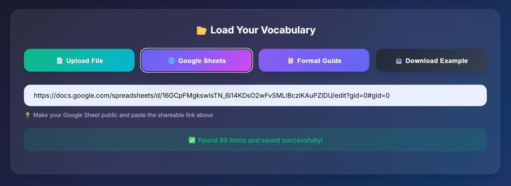
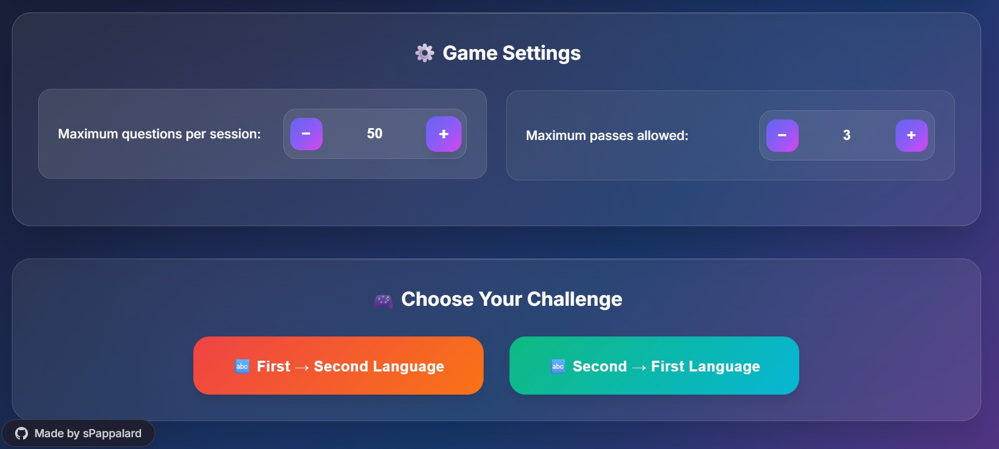
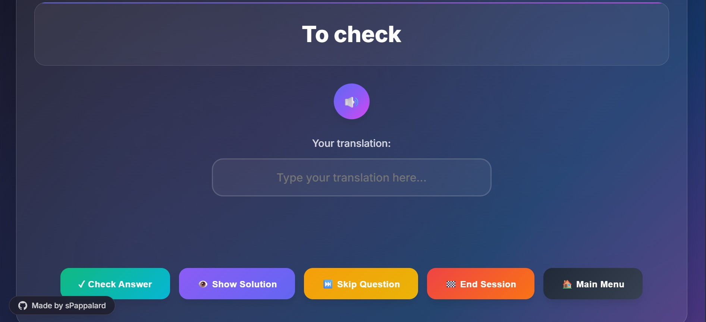
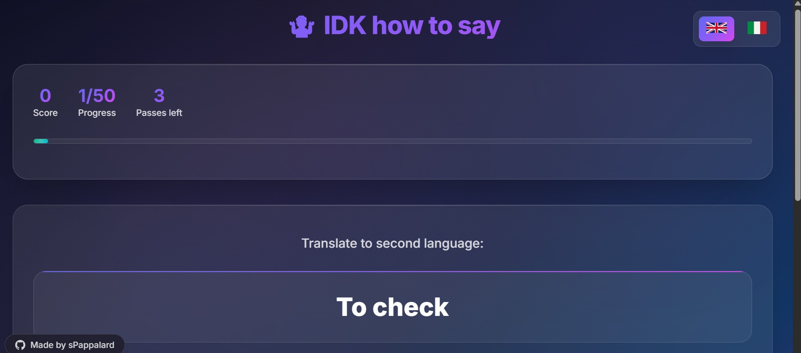
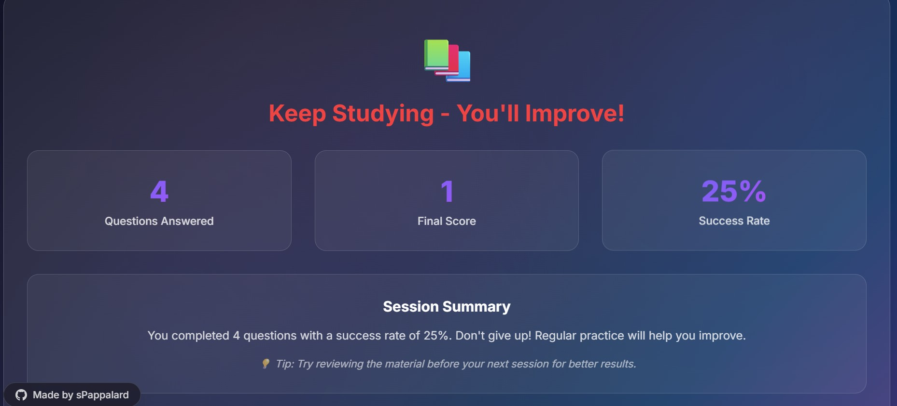

# 🤷 IDK how to say - Language Learning Game

A web-based interactive language learning application designed to help you master vocabulary through gamified practice sessions.

**🚀 Try the live demo:** https://idkhowtosay.onrender.com/

## 🎯 The Story Behind This App

This application was born from a personal struggle - I found myself constantly forgetting English words and verbs that just wouldn't stick in my memory, no matter how many times I encountered them. Traditional study methods weren't cutting it, so I started collecting these troublesome words in an spreadsheet, thinking I'd review them later.

The problem? Static lists are boring and ineffective for retention. I needed something that would actively quiz me on these words, track my progress, and make the learning process engaging. That's when "IDK how to say" was conceived - a gamified solution that transforms any vocabulary list into an interactive learning experience.

What started as a personal tool to master stubborn English vocabulary has evolved into a flexible language learning platform that supports multiple languages and can handle any bilingual word pairs you throw at it.

## ✨ Key Features

### 🌐 Multi-Language Support
- **Supported Languages:** English, Italian, French, Spanish, German
- **Bidirectional Learning:** Practice translating in both directions
- **Text-to-Speech Integration:** Google Cloud TTS for pronunciation practice
- **Flexible Language Pairs:** Support for custom "Other" languages (but not Audio supported)

### 📂 Flexible Data Import
- **Excel Files:** Upload .xlsx, .xls files directly
- **CSV Support:** Import comma-separated value files
- **Google Sheets Integration:** Direct import from public Google Sheets 
- **Smart Parsing:** Handles multiple translation variants (separated by /, ,, \, ())

### 🎮 Gamified Learning Experience
- **Interactive Quiz Interface:** Clean, modern UI with real-time feedback
- **Progress Tracking:** Visual progress bars and scoring system
- **Flexible Sessions:** Customizable question count (10-500 questions)
- **Skip System:** Strategic pass mechanism with limited uses
- **Performance Analytics:** Detailed session results and success rates

### 🔊 Audio Features
- **Pronunciation Practice:** Text-to-speech for both question and answer words
- **Smart Language Detection:** Automatically uses correct language for audio
- **Usage Monitoring:** Built-in Google TTS API usage tracking (1.000.000 free characters per month)
- **Optimized Performance:** Efficient audio generation and playback

### 🎨 Modern User Experience
- **Responsive Design:** Works seamlessly on desktop and mobile devices
- **Dark Theme:** Eye-friendly glassmorphism design with gradient accents
- **Smooth Animations:** Engaging micro-interactions and transitions
- **Multilingual Interface:** UI available in English and Italian

## 🛠️ Technical Stack

### Backend
- **Framework:** Flask (Python)
- **Text-to-Speech:** Google Cloud Text-to-Speech API
- **Data Processing:** Pandas for Excel/CSV parsing
- **Authentication:** Google OAuth2 service account
- **CORS Support:** Flask-CORS for frontend integration

### Frontend
- **Pure JavaScript:** No frameworks, lightweight and fast
- **Modern CSS:** CSS Grid, Flexbox, CSS Variables, Animations
- **Responsive Design:** Mobile-first approach with breakpoints
- **Interactive Elements:** Custom dropdowns, progress indicators, audio controls

### Architecture Features
- **RESTful API:** Clean separation between frontend and backend
- **Session Management:** Server-side game state management
- **Error Handling:** Comprehensive error handling and user feedback
- **Usage Tracking:** Built-in API quota monitoring and reporting

## 🚀 Getting Started

### Prerequisites
- Python 3.7+
- Google Cloud Text-to-Speech API credentials (optional, for audio features)

### Installation

1. **Clone the repository**
   ```bash
   git clone https://github.com/yourusername/language-learning-game.git
   cd language-learning-game
   ```

2. **Install dependencies**
   ```bash
   pip install -r requirements.txt
   ```

3. **Set up Google Cloud TTS (Optional)**
   - Create a Google Cloud project and enable Text-to-Speech API
   - Create a service account and download credentials JSON
   - Set environment variable: `export GOOGLE_APPLICATION_CREDENTIALS="path/to/credentials.json"`

4. **Run the application**
   ```bash
   python app.py
   ```

5. **Open in browser**
   Navigate to `http://localhost:5000`

## 📖 How to Use

### 1. **Configure Languages**
   - Select your source and target languages from the dropdowns
   - Audio will be automatically enabled for supported language pairs

### 2. **Import Your Vocabulary**
   - **Option A:** Upload Excel/CSV file with two columns (word pairs)
   - **Option B:** Share a Google Sheets document and paste the link
   - **Option C:** Download the example file to see the required format

### 3. **Customize Your Session**
   - Set maximum questions per session (10-500)
   - Configure number of allowed skips (0-20)
   - Choose translation direction

### 4. **Start Learning**
   - Answer questions by typing translations
   - Use audio button to hear pronunciation
   - Skip difficult questions strategically
   - Review solutions when needed

### 5. **Track Progress**
   - Monitor real-time score and progress
   - View detailed session results
   - Analyze success rates and improvement areas

## 📊 File Format Requirements

### Basic Structure
Your vocabulary file must have exactly **2 columns**:
- **Column 1:** Source language words
- **Column 2:** Target language translations

### Example Format
| English | Italian |
|---------|---------|
| house | casa |
| car | macchina |
| beautiful | bello/bella |

### Advanced Features
- **Multiple Variants:** Use `/`, `,`, `\`, `()` to separate alternative translations
- **Flexible Parsing:** Empty rows are automatically skipped
- **Header Support:** First row can contain headers (optional)

## 🎯 Use Cases

- **Language Students:** Practice vocabulary from coursework or textbooks
- **Professionals:** Master business terminology in foreign languages
- **Travelers:** Learn essential phrases and words for travel
- **Self-Learners:** Build custom vocabulary lists based on personal interests
- **Teachers:** Create interactive vocabulary quizzes for students

## Screenshots

### Main menu with language selection


### File upload interface


### Game Setting


### Active quiz session with question/answer


### Progress bar during a session


### End session - Results screen with performance metrics



## 📄 License

This project is licensed under the MIT License --->  [](https://opensource.org/licenses/MIT)

